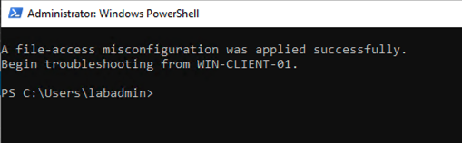
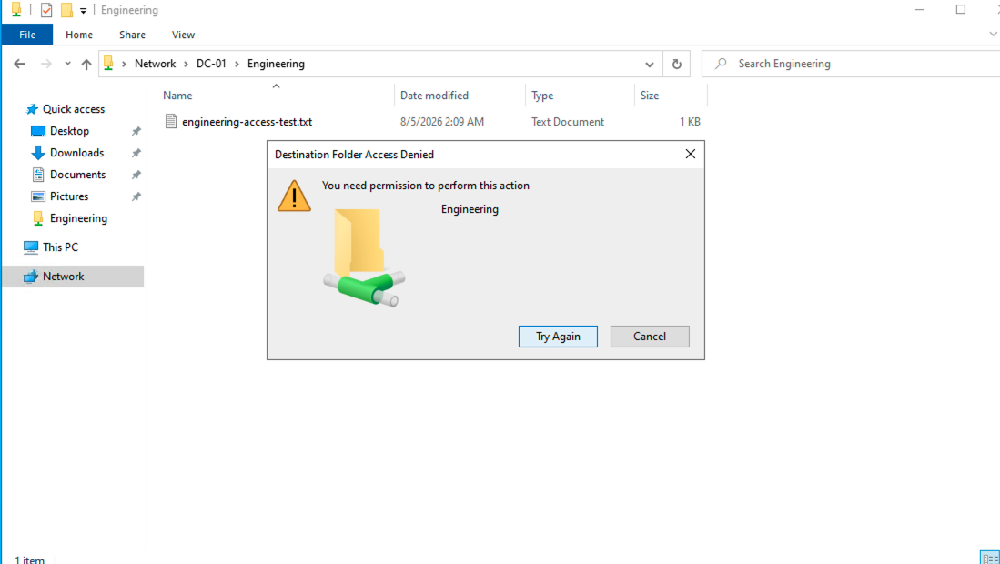
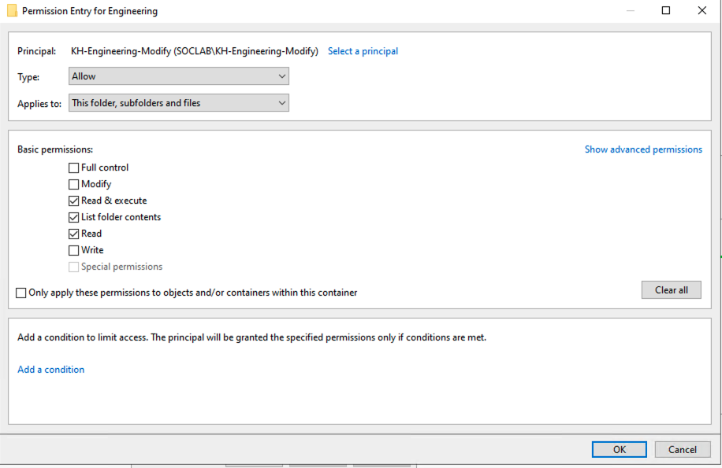
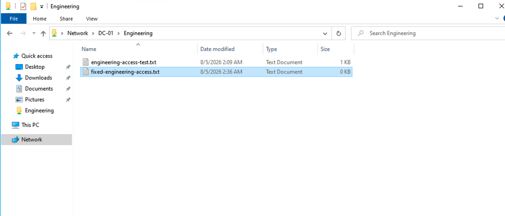
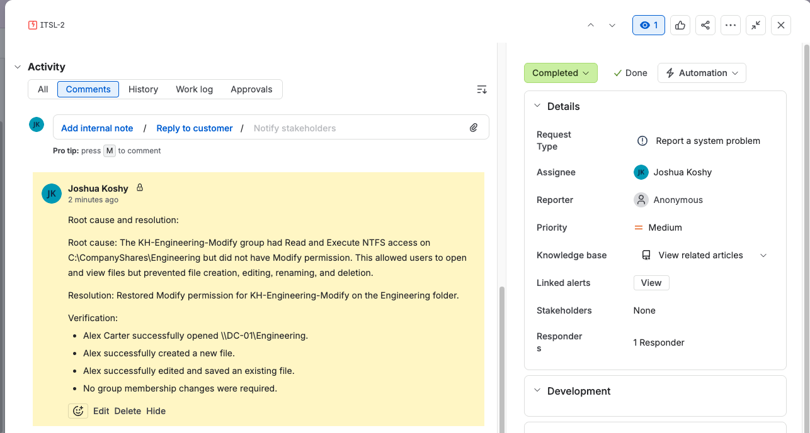

# Department Permission Error

## Ticket summary

Alex Carter could open the Engineering share but could not create or modify files.

## Controlled challenge method

This was a blind troubleshooting exercise in the lab. A PowerShell challenge safely introduced one permission misconfiguration without revealing which permission layer had changed. It did not use Deny permissions, remove administrators, delete files, or modify other shares. The exercise was not a production outage.

## Environment

- User: Alex Carter (`acarter`)
- Client: `WIN-CLIENT-01`
- Share: `\\DC-01\Engineering`
- Authorized group: `KH-Engineering-Modify`

## Reported symptom

Alex could browse the Engineering share and view existing files, but could not create a new file or edit and save an existing file. Windows displayed Access Denied.

## Business impact

Engineering work could be viewed but not updated through the shared folder. The initial scope was one reported user and required confirmation during troubleshooting.

## Troubleshooting sequence

1. Reproduced the write failure from `WIN-CLIENT-01`.
2. Confirmed Alex could reach the share and read existing content.
3. Confirmed Alex remained a member of `KH-Engineering-Modify`.
4. Checked the Engineering NTFS permissions.
5. Found that the group had Read and Execute but not Modify.
6. Checked the share permissions and confirmed they were not the limiting layer.
7. Restored Modify for `KH-Engineering-Modify`.
8. Retested file creation and editing as Alex.

## Root cause

The Engineering group had read-only NTFS access instead of Modify access. This allowed browsing and reading but blocked file creation and changes.

## Resolution

Modify permission was restored for `KH-Engineering-Modify` on the Engineering folder.

## Verification

Alex created a new file and edited and saved an existing file successfully.

## Jira documentation workflow

The ticket recorded the initial report, priority and scope, troubleshooting notes, customer-facing update, root cause, corrective action, verification, and Completed/Done status.

## Lesson learned

A user who can read but not modify is not necessarily experiencing a connectivity problem. Compare the required action with the effective NTFS permission, then correct only the layer that is restricting access.
