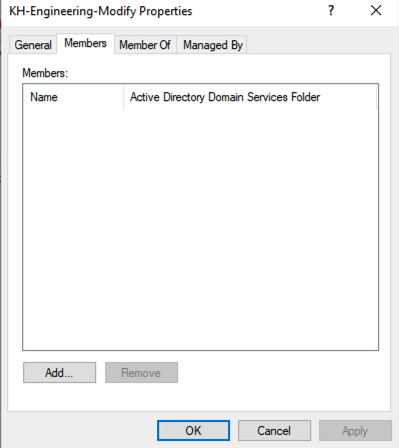
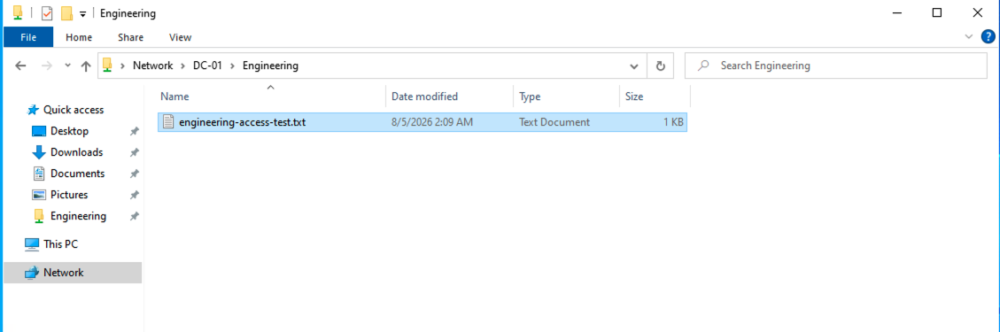

# Single User Access Denied

## Ticket summary

Alex Carter could not open the Engineering shared folder after a change to his access.

## Environment

- User: Alex Carter (`acarter`)
- Client: `WIN-CLIENT-01`
- Service: `\\DC-01\Engineering`
- Domain: `SOCLAB.LOCAL`

## Reported symptom

After signing out and back in, Alex received Access Denied when opening the Engineering share. The server, share, and folder were still available.

## Scope and business impact

The issue affected one user. Alex could not access Engineering project files, while the shared-folder service itself remained available.

## Troubleshooting

1. Reproduced the failure from the client using the UNC path.
2. Confirmed the server and share were reachable.
3. Checked Alex’s Active Directory group membership.
4. Found that Alex was missing from `KH-Engineering-Modify`.
5. Added Alex back to the group.
6. Had Alex sign out and back in to obtain a refreshed security token.

## Root cause

Alex was not a member of `KH-Engineering-Modify`, so he did not receive the intended NTFS Allow permission for Engineering.

## Resolution

Alex was restored to `KH-Engineering-Modify` and logged in again.

## Verification

Alex successfully opened the Engineering share and accessed its contents.

## Lesson learned

For a one-user access failure, verify group membership and the user’s logon token early. A group change is not fully reflected in the current session until the user obtains a new token.
