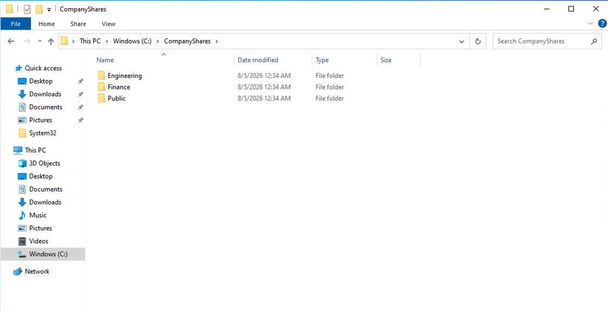
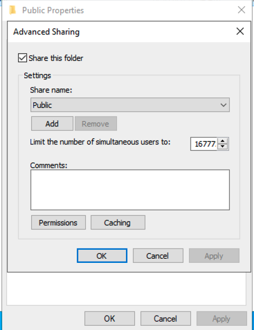

# Setup and Validation

## Environment

The lab uses `DC-01` in the `SOCLAB.LOCAL` domain as the file server and `WIN-CLIENT-01` as the validation client. Shared folders are stored locally at `C:\CompanyShares`.

## Folder structure

The server was organized into three departmental folders:

- `C:\CompanyShares\Public`
- `C:\CompanyShares\Finance`
- `C:\CompanyShares\Engineering`

## Active Directory groups

The access model uses security groups rather than assigning permissions directly to Alex Carter:

- `KH-Public-Modify`
- `KH-Finance-Modify`
- `KH-Engineering-Modify`

Alex was placed in the Public and Engineering groups, but not the Finance group. The group design is visible in [the AD evidence](screenshots/04-ad-file-access-groups.png) and [Engineering membership evidence](screenshots/05-engineering-group-membership.png).

## SMB sharing configuration

Each folder was shared using its matching share name. Share permissions use `Everyone` with Full Control so that NTFS permissions remain the primary restriction layer.

## NTFS permissions

Department groups receive Modify on their authorized folder. SYSTEM and Administrators retain Full Control. Finance and Engineering had inheritance disabled and inherited permissions converted to explicit entries; broad entries such as Users, Authenticated Users, or Domain Users were removed from the restricted folders.

Examples:

- [Finance restricted ACL](screenshots/09-finance-restricted-ntfs-access.png)
- [Engineering restricted ACL](screenshots/10-engineering-restricted-ntfs-access.png)
- [Public explicit ACL](screenshots/11-public-inheritance-disabled.png)

No explicit Deny permissions were used.

## Local paths and UNC paths

`C:\CompanyShares\Engineering` is the server’s local path. `\\DC-01\Engineering` is the network UNC path used by clients. A local test can confirm the folder ACL, but a client-side test through the UNC path validates the complete network access experience, including both share and NTFS permission layers.

## Share permissions versus NTFS permissions

The Sharing tab controls SMB access to the share. The Security tab controls NTFS access to the folder and its contents. Windows evaluates both for network access, and the more restrictive effective permission wins. This lab intentionally kept share permissions broad and used NTFS group permissions for the access design.

## Validation results

Testing was performed from `WIN-CLIENT-01` using UNC paths:

- Alex could create, edit, and save files in Public.
- Alex could create, edit, and save files in Engineering.
- Alex received Access Denied when opening Finance.

Evidence includes [Finance access denial](screenshots/11-finance-access-denied-for-unauthorized-user.png), [Engineering write validation](screenshots/12-engineering-modify-access-verified.png), and [Engineering access restoration](screenshots/15-engineering-access-restored.png).
