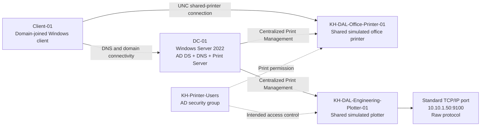

# Architecture Diagram

## Lab topology

## Component relationships

- `Client-01` uses the lab domain and validates end-user access to the shared printer.
- `DC-01` provides the directory, DNS, and print-management services used in this time-limited lab.
- `KH-Printer-Users` is the access-control boundary for ordinary printer users.
- The office-printer queue represents a shared office device.
- The plotter queue represents an engineering device whose network path can be diagnosed independently.

## Production difference

The lab consolidates services on `DC-01` to reduce Azure cost and setup time. In production, a dedicated print server or managed print platform would normally be considered, along with tested vendor drivers, restricted administration, monitoring, redundancy, and change control.
