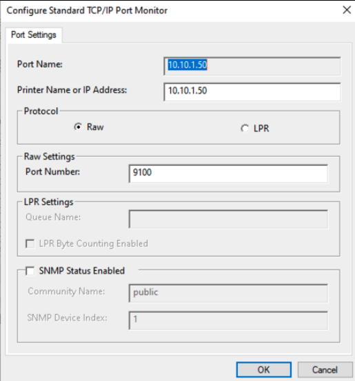
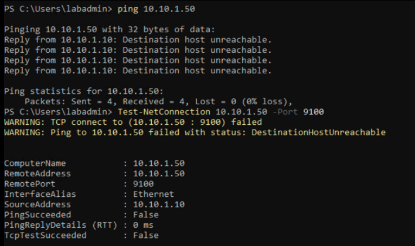

# Network Plotter Unreachable

## Scenario

The simulated engineering plotter was configured with a Standard TCP/IP port for Raw printing on port `9100`, but the configured endpoint `10.10.1.50` was unreachable during testing.

## Initial scope and impact

- Affected service: Engineering plotter printing
- Queue: `KH-DAL-Engineering-Plotter-01`
- Configured endpoint: `10.10.1.50:9100`
- Scope to determine: one workstation, the print server, or all engineering users
- Potential impact: inability to print drawings or plot sheets, possibly affecting project deadlines and client deliverables

## Diagnostic sequence

1. Confirm which users, workstations, and applications are affected.
2. Confirm the expected plotter queue and server.
3. Review the queue’s configured TCP/IP port and protocol.
4. Test name resolution if a hostname is used.
5. Use `ping` as a supporting signal, recognizing that ICMP may be blocked.
6. Test TCP port `9100` with `Test-NetConnection`.
7. Compare the configured address with the device inventory or office documentation.
8. Check for recent network, VLAN, firewall, device, or office-move changes.
9. Correct the configuration only after the expected address and protocol are confirmed.
10. Submit a controlled test job and verify the result with an engineer or office contact.

## Evidence

The port configuration and failed connectivity test are shown below:

The diagnostic output shows destination-host-unreachable responses and a failed TCP connection test to `10.10.1.50:9100`. The displayed `0% loss` statistic should not be interpreted as successful connectivity; the replies were unreachable errors generated by the source environment, and `TcpTestSucceeded` was `False`.

## Root cause status

The lab evidence confirms that the configured endpoint was unreachable. It does not by itself distinguish an incorrect IP address from a powered-off device, missing route, VLAN or firewall issue, or an absent listener. In production, the next step would be to validate the address and device status with the network or office-support owner before changing the queue.

## Escalation package

If escalation is required, provide the queue name, server, configured address and port, protocol, source address, exact test commands and results, affected users, business deadline, workaround, and any recent-change information.
