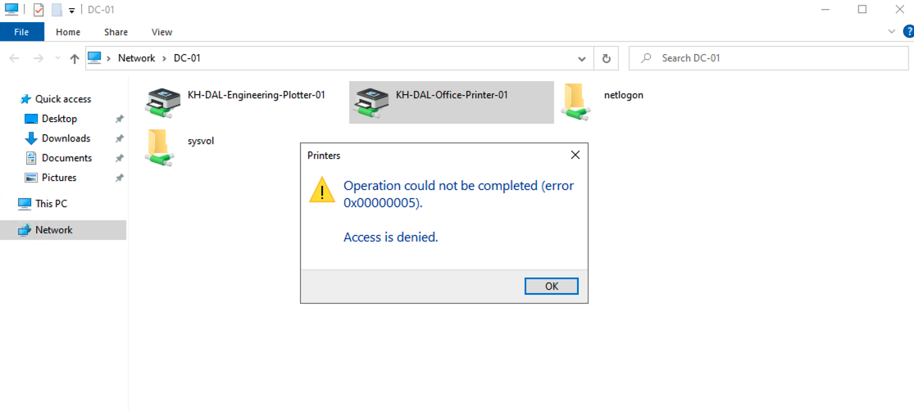
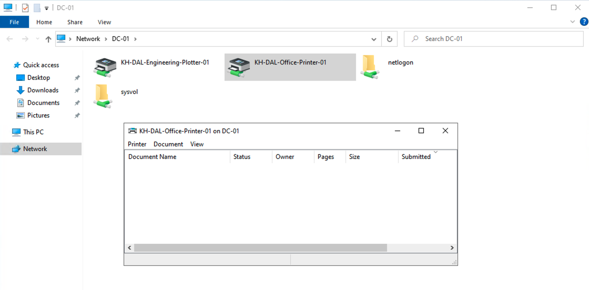
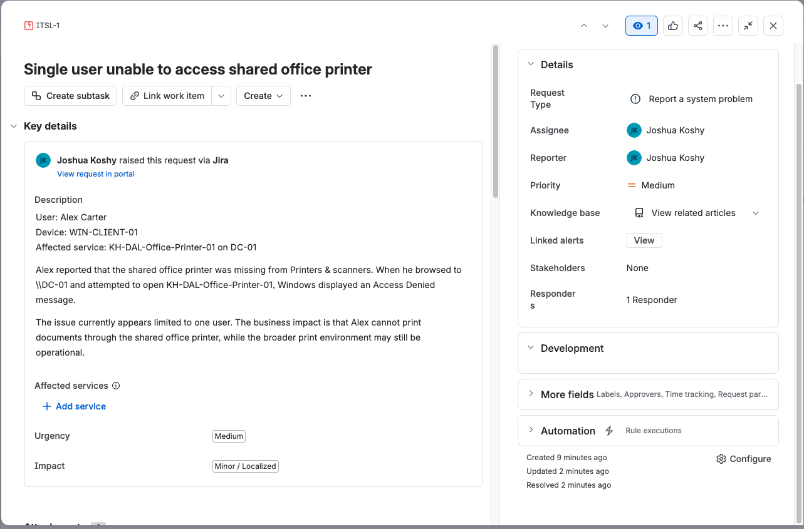
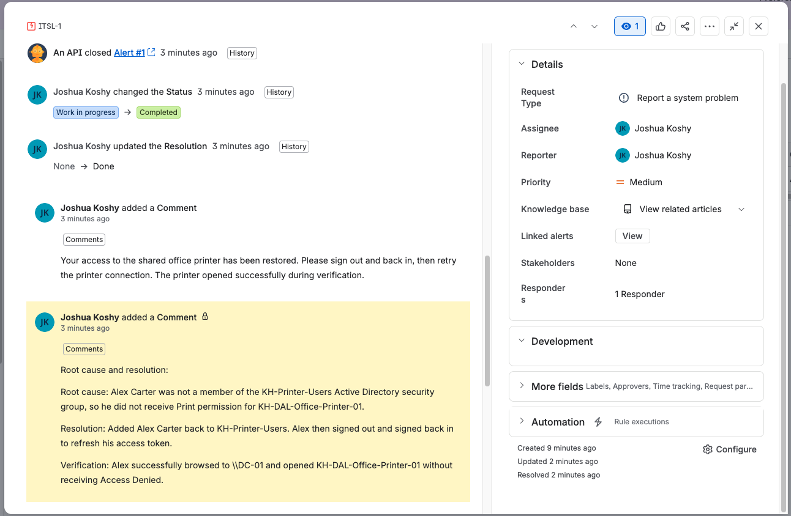

# Single User Access

## Scenario

Alex Carter could not access the shared office printer while the broader print environment remained available for other users. Windows displayed error `0x00000005` with the message `Access is denied`.

## Initial scope and impact

- Affected user: Alex Carter
- Client: `WIN-CLIENT-01`
- Service: `KH-DAL-Office-Printer-01` on `DC-01`
- Scope: Single user
- Impact: Localized printing interruption with a possible workaround through another printer
- Initial priority: Medium, because the issue affected one user and was not shown as a broad print-service outage

## Investigation

The troubleshooting path focused on the distinction between a user-specific issue and a server-wide issue:

1. Confirm the exact Access Denied error.
2. Check whether the same shared printer is visible and usable for another account.
3. Review Alex’s membership in `KH-Printer-Users`.
4. Review the printer Security tab and confirm that the group has Print permission.
5. Refresh the user session after correcting group membership so the updated access token is used.

## Root cause

The captured Jira resolution record identifies the root cause: Alex Carter was not a member of the `KH-Printer-Users` Active Directory security group and therefore did not receive Print permission for the shared printer.

## Resolution and verification

Alex was added back to `KH-Printer-Users`, signed out and back in, and then successfully opened the shared printer without receiving Access Denied.

## Ticket lifecycle evidence

The Jira screenshots show the intake details, priority, impact, resolution, root cause, corrective action, customer-facing communication, and verification.

## Lesson

When one user is affected and other users can still use the same service, begin with identity, permissions, mapping, profile, and local configuration before changing the print server.
