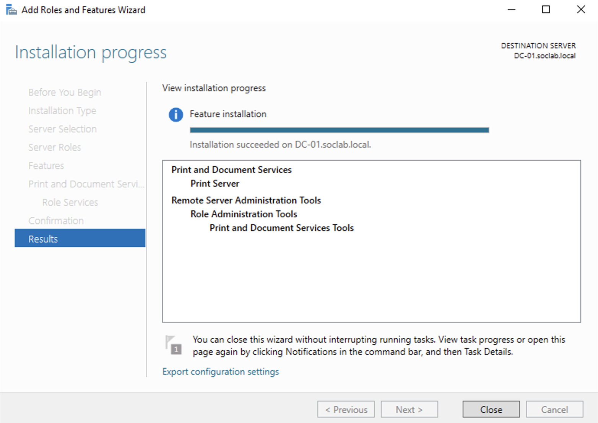
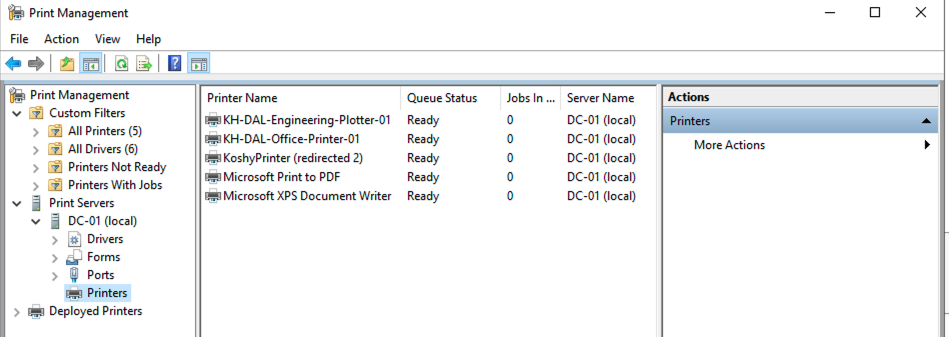
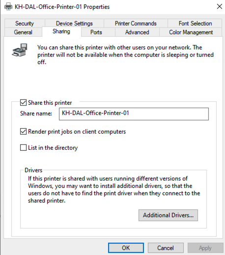
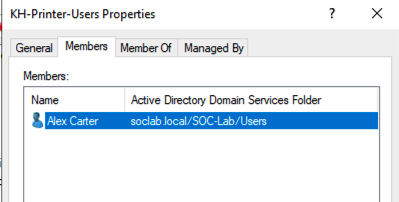
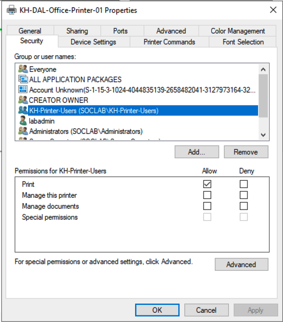
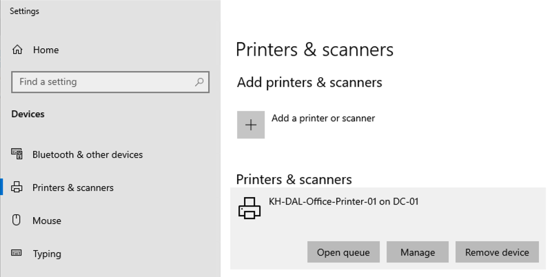
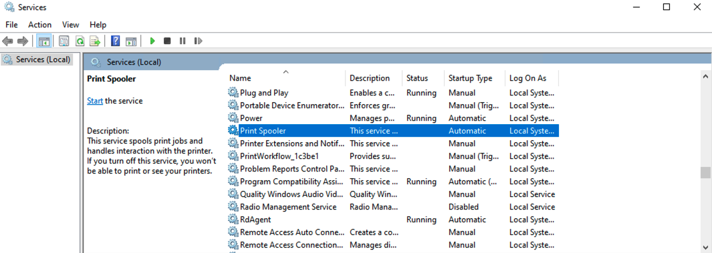
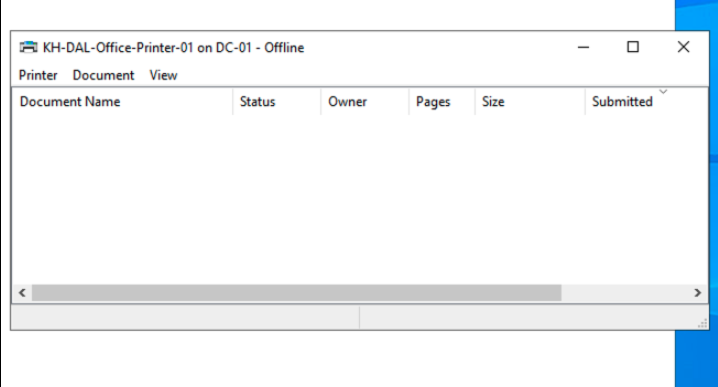
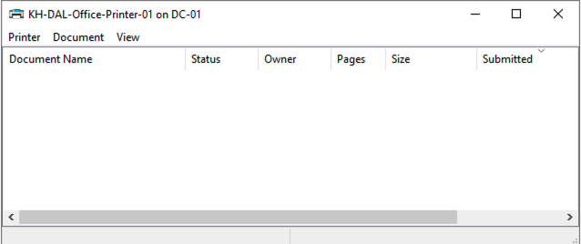

# Setup and Validation

## Baseline validation

### Client domain and connectivity validation

Client-01 was accessed using the domain account shown as `soclab\acarter`. The client successfully resolved `dc-01.soclab.local` through DNS and communicated with the domain controller at `10.10.1.10` with successful ICMP replies and no packet loss.

## Print-server setup evidence

### Print and Document Services

Print and Document Services and the Print Server role service were installed successfully on `DC-01.soclab.local`.

### Print Management queues

Print Management shows the simulated office-printer and engineering-plotter queues on `DC-01`. Both queues are shown as Ready in the captured evidence.

### Office-printer sharing

`KH-DAL-Office-Printer-01` is configured as a shared printer with the visible share name `KH-DAL-Office-Printer-01`.

### Plotter TCP/IP port

The simulated plotter uses a Standard TCP/IP port configured for Raw printing on port `9100` and the address `10.10.1.50`.

## Access-control validation

### AD group membership

The evidence shows Alex Carter as a member of the `KH-Printer-Users` Active Directory security group.

### Least-privilege printer permission

The `KH-Printer-Users` group is assigned Print permission while Manage this printer and Manage documents remain unassigned in the captured permission view.

## Client validation

### Shared printer connection

Client-01 displays `KH-DAL-Office-Printer-01 on DC-01`, confirming that the client can see the shared printer connection.

## Failure and recovery evidence

### Single-user access failure and restoration

The single-user scenario produced Windows error `0x00000005` with an Access is denied message. After the access issue was corrected and the user session refreshed, the printer queue opened successfully.

### Print-service outage and recovery

The Print Spooler was stopped during the simulated outage. The shared queue then displayed an Offline symptom, and the queue was available again after print-service recovery.

### Plotter connectivity diagnostic

Connectivity testing from the print-server environment showed the configured plotter endpoint `10.10.1.50:9100` was unreachable. The output includes a destination-host-unreachable result and a failed TCP connection test.

## Ticketing evidence

The first Jira incident captures intake, affected user/device/service, priority, urgency, and impact. The resolution history captures status transition, resolution, customer communication, root cause, corrective action, and verification.

## Validation checklist

- [x] Client resolves `dc-01.soclab.local`.
- [x] Client communicates with `DC-01`.
- [x] Client uses a domain account in the captured evidence.
- [x] Print Server role is installed on `DC-01`.
- [x] Office-printer and plotter queues exist in Print Management.
- [x] Office printer is shared.
- [x] Plotter TCP/IP port is configured.
- [x] Printer access is assigned through an AD group.
- [x] Ordinary users receive Print permission without printer-management permissions.
- [x] Client sees the shared printer.
- [x] Single-user access failure and restoration are captured.
- [x] Print Spooler outage, offline symptom, and recovery are captured.
- [x] Plotter connectivity failure is captured.
- [x] Jira intake and resolution evidence are captured for the first incident.
