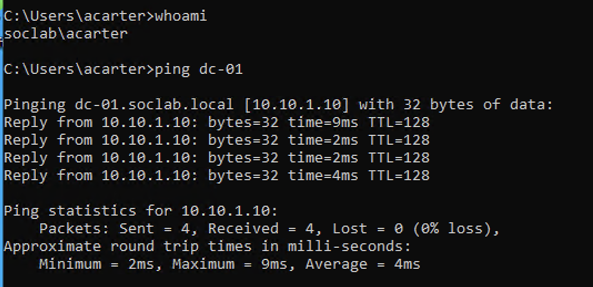

# Setup and Validation

### Client domain and connectivity validation

Client-01 was accessed using the standard domain account `SOC-LAB\acarter`. The client successfully resolved `dc-01.soclab.local` through DNS and communicated with the domain controller at `10.10.1.10` with no packet loss.

